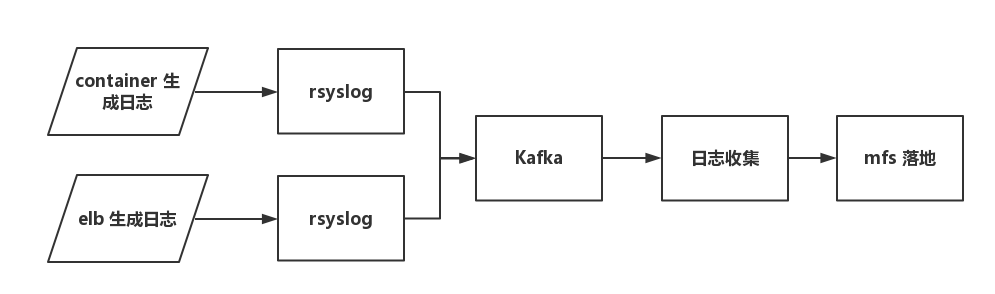

—— 这是平台工程师小马的纪录，他纪录了 ENJOY 后台日志系统的变迁，为的是总结他十一以来的工作（以及模仿希罗多德装逼）

## 深渊混沌，无可名状
我刚来 ENJOY 的时候，我们只有A机房，并没有一个日志收集中心。 Apollo 的日志保存在它们自己的服务器上面，都是纯文本，保存若改天后抛弃掉。 Prometheus 更惨，它前面有一个 nginx 做 LB，但是这个 nginx 的 access log 并没有被认真对待过，prometheus 本身的 log，额，既没有分割，也没有集中处理。就堆在那里，没事没人看，有事也看不出来。

现在回想起来，当时的日志系统就好像一个深渊，看一眼都会掉 san 值， 非常克苏鲁。

## 矇昧始觉，雪夜曙光
随着 eru 平台的上线，我们终于开始有了一套相对完善的日志收集系统。 eru 平台上主要收集了两种日志：容器产生的日志和 elb 的 access log 。当时 elb 日志系统的体系相当简单：

这个架构相当简单明了。但是存在一个问题：agent 到日志收集服务器之间缺乏一个缓存（实际上 agent 是有一个比较小的缓存的，但一般没有开），而日志收集服务器作为一个单点，是整个系统最薄弱的一环。整个问题一直困扰着 eru1 。

最早的日志收集服务是用 logstash 做的。 logstash 存在两个问题：1. grok 难写（不多说，说起来都是泪，谁写谁知道）；2. 重启慢，而且当时还遇到一天死几次的情况，让人不得安生。 所以我着手的第一个工作是选择 logstash 的替代品。在各种日志收集工具中，最终我们选择了 heka，这很大一部分原因是宜信的 lain 也在用它。 其实也考虑过知乎的 kids，无奈的是，知乎自己弃坑之余，kids 自己的可扩展性并不好（heka 可以写 lua 脚本）。

最后 eru1 的日志收集服务就采用了 heka， 但当时存在两个问题：1. heka 处理时间时候有点问题，它拿到的是零时区的时间戳，这导致了你看到的 2016-11-29.log 的日志，其实是 2016-11-29 08:00:00 ~ 2016-11-30 07:59:59; 2. heka 处理 elb 数据的 docoder 插件经常会死掉，很尴尬的是，只会死这个插件，想监控都很困难。

随着接入日志的增多，我们开始将日志输出到 ES。 所以为了解决上一段提及的问题2， 我写了一个定时程序，定时访问 ES, 拿最新的时间戳，如果这个时间落后实际时间5分钟，那就重启 heka。 这是一个粗糙的方法。

值得注意的是，这个时候，我们依然保持了 agent 和 elb 直接向 日志收集系统发日志的架构。这导致后来的一场灾难。

## 红尘轮回，再问征途

