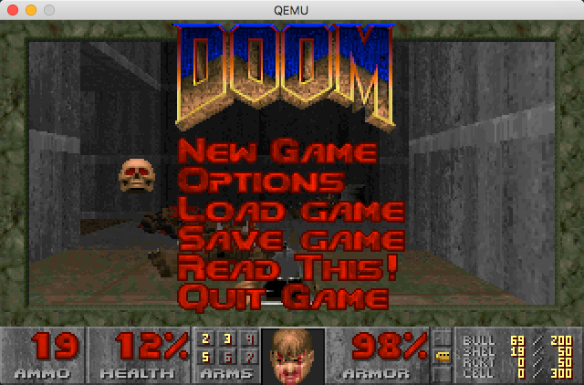

**每个人都有无法实现的梦想。或许是那梦想需要太多时间和金钱，譬如开跑车驰骋，驾飞机翱翔;或许是那梦想太过于离谱，例如与异形进行星球大战，与吸血鬼拼个刺刀见红;或许是那梦想会违反法律，譬如血洗乐园，夜半尾行。但不管能否实现，它们总盘旋在你脑海里，每一天，让你浮想联翩。这就是为什么会有一个上亿美元的产业来帮助人们实现各种光怪陆离的白日梦;这就是为什么会有电子游戏。** —— 《DOOM 启世录》[注1]

大家都知道约翰·卡马克和他不朽的作品，他为游戏世界带来的创造性工作是划时代的。今天给大家介绍一些，用 `qemu` 创建 `dos` 虚拟机并安装 Doom。[注2]

## 安装 qemu

如今三条腿的牛蛙好找，有软盘的电脑难寻，如果想体验 DOS 我们 需要一个虚拟环境。这里我推荐 `qemu`（这当然也是个人爱好，因为 [openresty](https://openresty.org/en/) 的作者曾经[高度评价 qemu 的作者](https://www.weibo.com/1834459124/GFOybDY4F)）。

首先我们来安装 `qemu`：

```bash
brew install qemu
```

安装完成之后，输入 `qemu` 然后用 `tab` 键补完，你会发现多了一堆命令。 其中：

|命令|说明|
|---|----|
|qemu-edid|测试 edid generator 的工具|
|qemu-img|`qemu` 的磁盘管理工具，可以用来创建 `qemu` 镜像|
|qemu-nbd|`qemu` 的网络块设备服务器|
|qemu-system-*|`qemu` 启动虚拟机的命令，星号代替不同的架构，比如i386和x86_64|

## 用 qemu 安装 dos

然后我们来安装 `dos`。安装 `dos` 有两种方法，一种是选择 `dos` 安装镜像，然后大家复习一下重装 `windows` 系统的过程：格式化硬盘、分区、安装、安装不成功重新格式化再来一遍，嗯，非常有挑战性。大家可以下载 [freedos](http://www.freedos.org/download/)，它还附带了[安装教程](http://wiki.freedos.org/install/)。至于如何使用 `qemu` 从头创建一个 `dos` 虚拟机，可以参考[这篇文章](https://opensource.com/article/17/10/run-dos-applications-linux)（总的来说就是先用 `qemu-img` 创建一个空的镜像，然后用 `qemu-system-i386` 跑起来，模拟用光盘安装 `dos` 的过程，但假如你是 mac 用户，记得把这篇文章里面示例中的 `-display gtk` 去掉，不要问我为什么会知道，没有故事）。

但我作为一个良心的攻略制作者，当然会为大家提供“爽到”攻略。这个攻略里面，你只需要按如下步骤操作：

1. 下载[freedos-1.2.7z](https://github.com/palmercluff/qemu-images/tree/master/freedos-1.2) 到你喜欢的目录并解压缩
2. 执行如下命令：`qemu-system-i386 -hda freedos-1.2.qcow2 -m 256`[注3]

然后你就获得了一个运行中的 `dos` 虚拟机了！惊不惊喜，高不高兴？

## 安装 Doom

接下来，我们安装 Doom。

首先，我们在 `freedos-1.2.qcow2` 所在的目录下，创建一个新的目录，目录名随意（以 dosfiles) 为例。

然后我们下载[Doom](https://www.dosgamesarchive.com/download/doom/)，到 dosfiles 目录并解压缩。

接下来，我们用如下命令启动 `dos` 虚拟机（记住，启动之后就不要修改 dosfiles 目录了）。

```bash
qemu-system-i386 -hda freedos-1.2.qcow2 -m 256 -drive file=fat:rw:dosfiles/,format=raw -boot order=c
```

这道命令会让把 dosfiles 目录挂到虚拟机中。在虚拟机中，输入 `D:` 进入 D 盘（一个有年代感的词，“阿Sir，我唔用 windows 好多年啦！”）。 `dir` 一下，你如看见如下界面：


`cd DOOM19S` 进入目录，运行 `INSTALL.bat`，开始安装过程。

安装完成之后，你就可以开始你的“毁灭之路”了，猎运亨通！



* [注1] 我想读者已经留意到了，本文标题就是致敬这本书。
* [注2] 对于理工科来说，过去的经典是不必再读的（学物理的人不会再去读《自然哲学的数学原理》），但是游戏不一样，即使在画面已经进步了无数个世代，一些伟大的游戏依然能让我们愉悦，让我有所发现，很大原因是：它们的成功是建立在对游戏的本质理解上的。在这种意义上，玩一些旧游戏有“阅读原典”的作用。
* [注3] [qcow2 镜像格式](https://people.gnome.org/~markmc/qcow-image-format.html)
