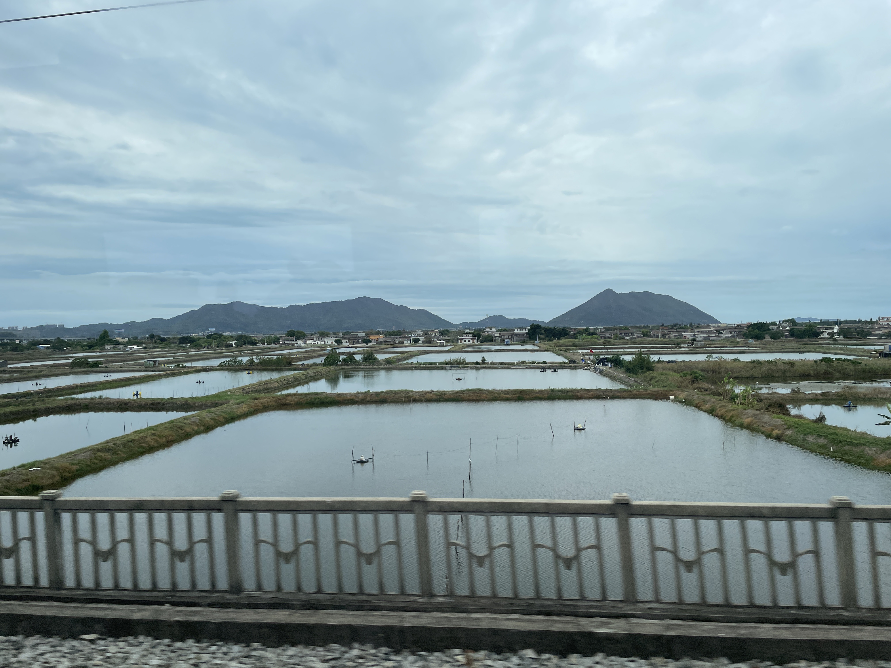
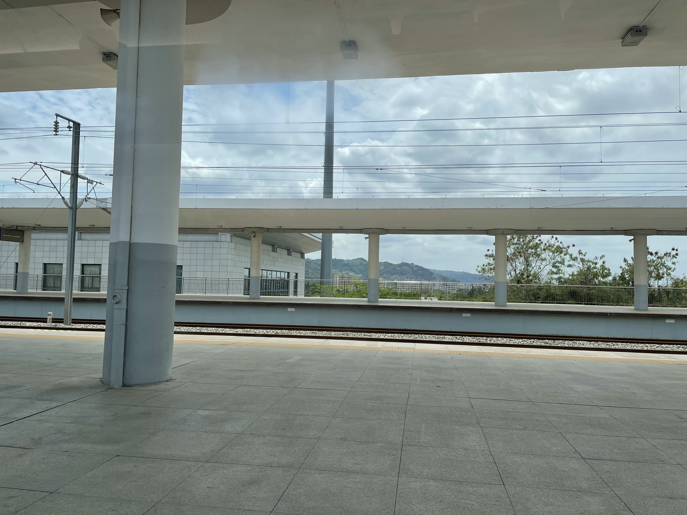
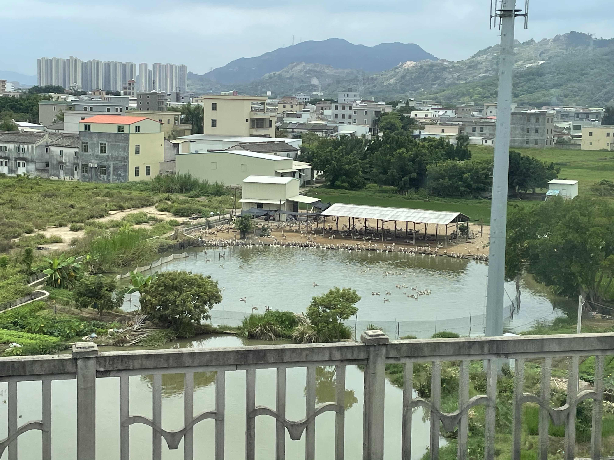
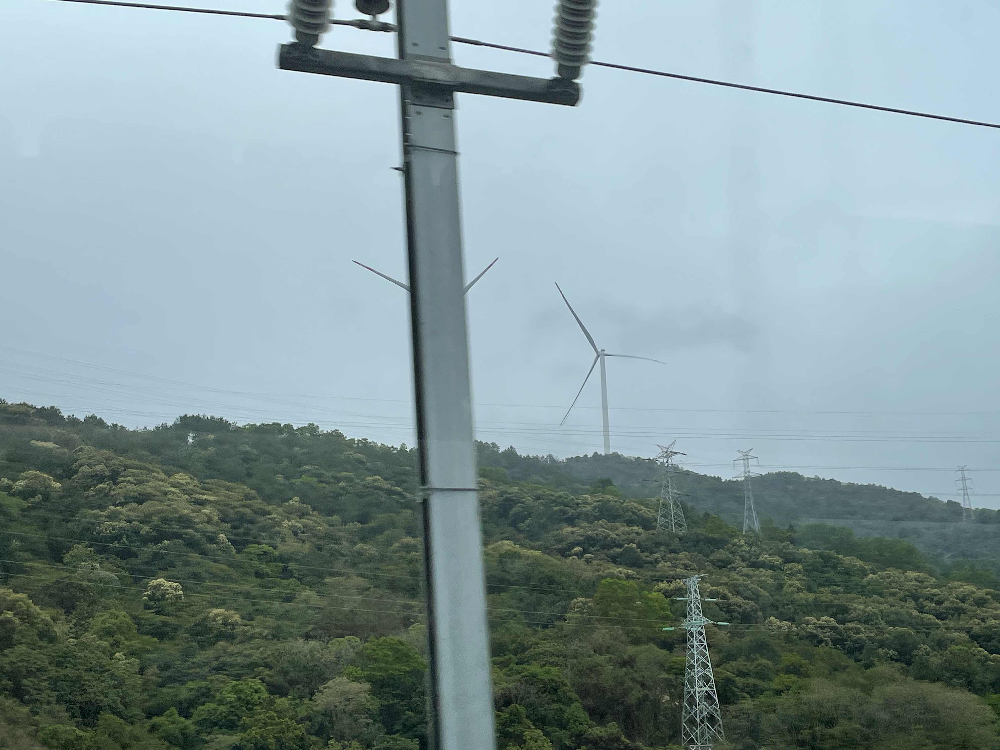
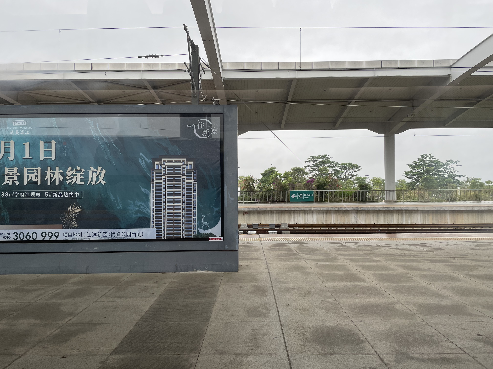
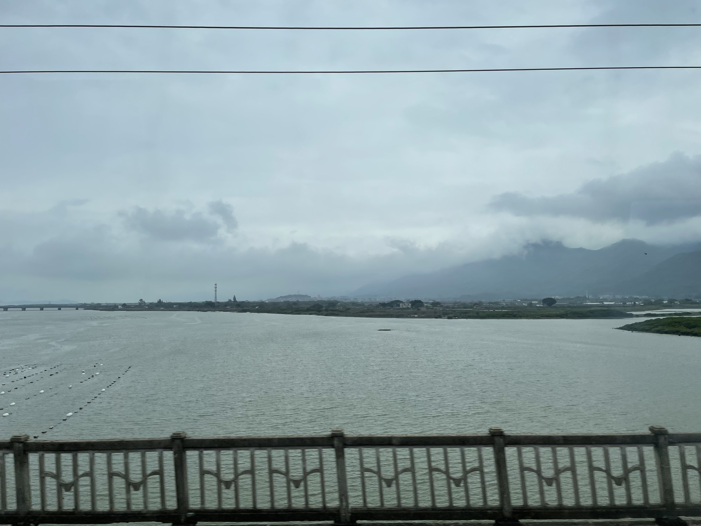
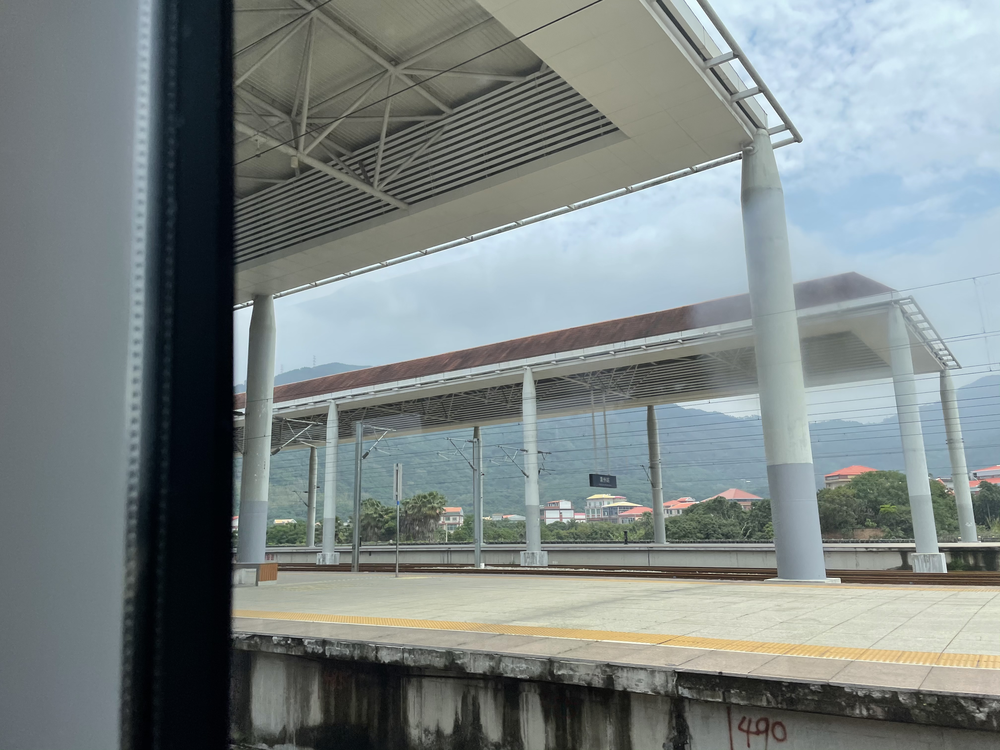
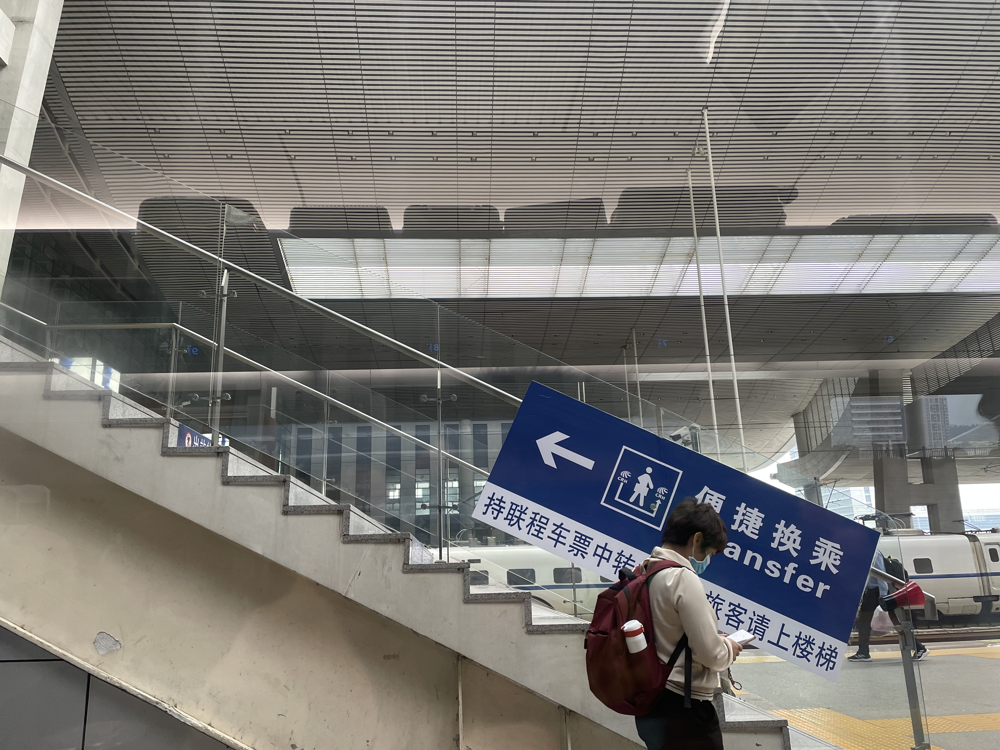
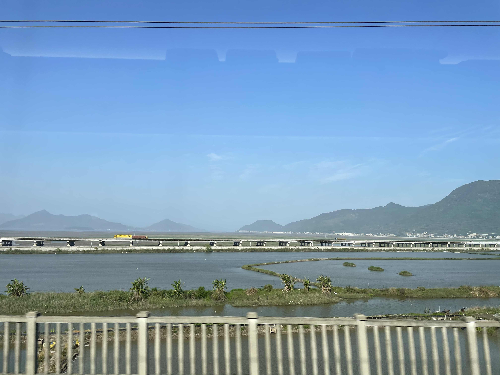
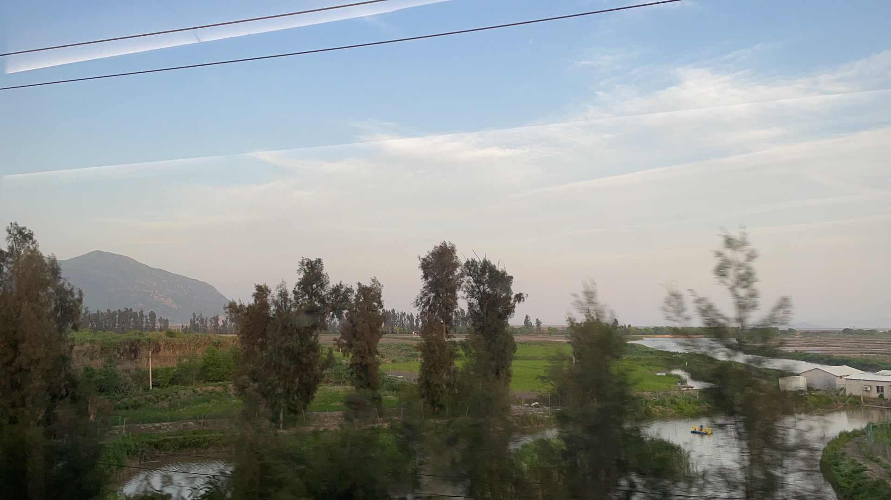

每次出门远行我都会很焦虑，尤其担心赶不上列车。今天起床我一如既往地赖床了。在西乡上地铁的时候还刚好错过了一班车——下一班隔了好几分钟，但是我觉得格外漫长。赶到高铁站的时候还在候车，过安检的时候就开始检票了——不过比上周去广州的时候安检的时候已经开始检票好。

上车的时候我把车厢看错了，以为是3号车厢（其实是5号），我特别害怕出现这种错误，这种焦虑终极想象是：我坐下了，列车开了，我才发现我上错车了。

这次旅程我没有带耳机，因为它太大了，而且也无力对抗小孩子的尖啸。列车开出不久，我就听到一个一丝不苟的声音在讨论工作，对方应该是跟一个销售在讨论，我觉得挺有趣味，所以记上一笔。这趟旅程全程12个小时多，我的主要娱乐就是写作和读书，我准备在这趟旅程里面读完保罗·索鲁的《在中国大地上》。

我对旅行一直有一种旖旎幻想：希望跟邻座一见如故，相谈莫逆，下车后挥手告别相忘江湖。到目前为止这种幻想没有一次成真。这次我的邻座是一个中年秃顶（M秃）大叔(其实我也是中年人了）。上车后不久，他就把眼镜顶到头上，凑近手机，看一篇民族主义的文章（第二小节的标题是中国航母加大对日本的压力）。这一段我都不好意思放在小桌板上写（写这一段的时候，之前那个跟销售对接的男人接到领导的电话，真是繁忙）。

说起来，为了这次旅行，我考虑买一个 iPad 带键盘。但是看了一下价钱和重量，我最后买了一个手机支架和一个折叠式的蓝牙键盘，这样我可以在高铁的小桌板上写下大段的笔记。

使用 notion 有一个好处，我可以随时插入我无法描述但觉得有意思的景色，可惜我并不知道这是哪里。这里应该是汕尾的郊区，因为随后列车临时停在了汕尾站（停了很久，不知道为什么）。汕尾是我大学室友朱老师的故乡。

10:55 我开始肚饿，昨晚只吃了李子和梳打饼，今天出门也只带了几个李子和梳打饼。我准备在车上节食。说起来，出门前我还想着买一个小罐子带茶叶，逛了两家超市和一家 Muji 都没有大小合适的罐子，最后我放弃了，直接把一包茶叶带了出来（反正也剩不了多少了）。

晚点了15分钟之后，列车从汕尾站开出。此时的保罗·索鲁在贝加尔湖旁边抱怨他的酒店缺乏维护，而在此之前两天，切尔诺贝利发生了核泄漏。

即将到普宁站的时候，旅行途中最难受的事情发生了，前排的孩子哭喊起来，大喊要回家，他的妈妈尽力安抚他。普宁站有乘客上落，8座的乘客好像丢了行李（下车的乘客把他的行李箱拿走了），他的证件都在里面。一阵忙乱之后，乘务员和铁路警察过来了，梳理了事情的经过，怀疑是一个黑色双肩包的主人拿走了他的行李，警察举着黑色的双肩包让人认领。我也担心地看了一下我的背包。

下一站是潮阳站。

下一站就是潮汕站了，不知道之前那个丢了包的人怎样了。我觉得 Notion 保存日志的方式有点糟糕：一到信号不好的时候，图片就无法正常加载，他们是把所有东西都放在服务器里面吗？保罗·索鲁已经到了北京，大使夫人包柏漪为他举办了晚宴，萧乾和董乐山也来了。董乐山跟保罗·索鲁说起《1984》，说它是内部刊物（确实是，董还认为这本书被限制阅读是有必要的），保罗·索鲁在这里讽刺地写道，八个月后他在厦门的公共图书馆找到了董译的《1984》。

到潮汕站，之前丢包的旅客还没有找到包，他说包里有他另外一个电话，但是打过去没有人接。因为实名制的缘故，他对找回包还是挺有信心的。我回头看了一下，他就是那个谈生意的男人，他还打了个电话跟别人说这件事。旁边两个旅客也都跟他谈笑起来。

即将到饶平站了，我在路边看到两组风力发电机，因为信号问题，我都不知道自己的位置，只能通过列车广播了解下一站。广播之后，乘务员过来找丢包的旅客，说他们已经联系上拿错包的人了，丢包的旅客就跟乘务员一起走了。我抬头在车厢里看了一下，发现12排那里坐了一个和尚。

         

下一站是诏安，光是听广播我根本打不出这个站名。

下一站就是樟州站了，也就是说，我要离开广东了。列车途经云霄站（真是一个有派头的名字），但是不会停站。信号一直很差，我没有办法插入图片。

其实，漳州站让我想起烟火。

与保罗·索鲁相反，他一句南下，此时刚到广东，而我刚出广东。下一站就是厦门北了。我吃掉最后一个李子。还有九个多小时的旅程。车厢里有人泡方便面——挺好的，我享受了面的香气，但不用承担吃面的无聊。

在厦门北停靠的时候，我尝试去厕所，但是好几节车厢的厕所都说故障了，最后我在6车等了好长一段时间，才终于等到有空位。厕所没有我想象中那么脏（很久以前火车上旧式厕所上横着一坨屎的景象在我脑海里挥之不去），当然也不是很干净，气味很难闻，马桶坐垫上有踩过的痕迹。

回来才发现中国发射了空间站的核心舱，回头得补一下新闻。丢包的旅客已经跟邻座的乘客攀谈起来，说起各自的生意。

不经意间我们到了泉州站。从泉州站出来我觉得困了（实际上也饿了，但是我只剩下两包梳打饼），所以我决定收拾好东西睡一觉。

半睡半醒眯了一会，清醒过来已经快三点，列车驶入了福州南站。旁边的乘客手机没电了，他想问同伴借充电宝，但被告知充电宝也没电了。他变得沮丧，烦躁。幸好他能保持安静，而且他的同伴找到高铁上充电的插孔。

醒来的景色变得好了一点，可能是因为出太阳了，一变上午沿途的阴郁。

三点半时，车上开始卖奶油爆米花，空气中都是甜腻的味道，我决定吃掉最后一包梳打饼。

下午我一直没能在 notion 上传图片，所以我的心情变得有点糟糕——我无法记录我到过的车站（因为拍照的时候并不没有拍到车站名），我迁怒于 notion 本身的设计，它应该要留下一份本地草稿而不是啥都上传。我放弃在这份游记中拍照了，有这精力还不如看看路边的风景。前面的小孩大喊着“到了，到了”，他的母亲也同样讨厌。

保罗·索鲁的行程中，总有中国官员的跟随。这让他烦躁不安。他对随行的中国官员充满敌意（谁不会呢）。现在出行的景象跟他当时的描述已经大不相同了，如果他再来中国，估计不会有那么多人找他聊天，一方面是“鬼佬”已经不新鲜了，另一方面就是有手机。我这一路都是对着自己的手机和 Kindle，没有跟旁边的人说一句话。

列车两旁的风景大部分时候都很平凡，民居和建筑都没有什么特别的（对审美好的豆瓣友邻来说当然是丑）。偶尔惊鸿一瞥，有些奇景在日常的平凡中超然而出，这个时候我往往来不及拍照，这不能不算一个遗憾。

我开始想朱老师所说的“到底怎样的旅行”才是愉快的，加上保罗·索鲁的书，我觉得去看灵山大佛并不是一个好主意（那玩意儿到底有啥好看的？如果释尊复生，不得来个如来神掌把它推平了）。或者明天我会绕太湖走一圈，东林书院倒是可以去看看。

我想我是没法享受在列车上跟人搭讪的乐趣了，早上丢包那个老哥倒是谈笑风生——可能他是一个销售人员吧。

有意思的是，在温州，我看见相距不远就有两间类似教堂的建筑。旁边的大叔在温州南站下车，位置暂时空了出来。不过一个头发斑白的大叔上车了，令人失望。下一站是雁荡山站。

过了乐清站（雁荡山还在前面）之后，隧道多了起来——这令我烦躁，因为我连上了高铁 wifi 而隧道屏蔽信号。

到台州站之前，听列车广播，台念第一声。台州过去不久就6点多了，天色很快黑下来 。现在窗外已经没有风景，乐趣唯余看书写作。现在保罗·索鲁已经去了厦门，他遇见一个美国出差的员工，后者向他抱怨中国工人愚笨，所以奉劝那些民族主义上头瞧不起这瞧不起那的同胞有空也要想想，我们当前也是也不咋的。

到宁海站的时候天就全黑了。温州南上来的大叔下车了。有点尿急，但是我不想去列车上的厕所，还有三个多小时，我决定忍了。

宁波站上来了一个脖子上纹着草帽团海贼旗的姑娘。她看了几个视频之后就开始看小说，其中一个角色叫戚临清。

我最终还是决定上厕所，因为我想起有个说法：永远不要拒绝饱餐一顿和打盹的机会（我会加上上厕所这一项）。然后我发现车上是有蹲厕和马桶两种厕所的。当然气味都很难闻。

差不多八点的时候，乘务员过来兜售15元一盒的盒饭，我买了一份宫保鸡丁。当然，这个盒饭没资格叫宫保鸡丁，它只有咸味和辣味，连炸花生都没有，但饥饿让我吃完了这份饭，原定的节食计划，不出意外地破产了。

最后，顺利入住7天，入住的时候，前台小姑娘非常贴心地让我在小程序上预定，这样可以便宜一点，办理入住手续之后，我去买了一瓶矿泉水，回来后我问她附近有什么本地的饭店（我特意强调是本地人喜欢的，不是驴游客那种），她给我推荐了旅馆附近的一家饭店（我买水的时候就看见了）。我决定明天下去鼋头渚玩一趟，我会尽量多步行，所以预计会有有点累，回程的时候再去尝试一下这家酒店。后天回去东林书院，顺便找点别的好吃的。
