五一劳动节那天晚上，我在无锡站坐车到上海（全程大约一个小时），当时我觉得其实旅游计划有点问题，我应该先去上海再去无锡的。我在无锡站累得差点睡着。

订的旅馆是7天江宁路玉佛寺店（不能不说上海毕竟是大城市，我订的房间比无锡的小但是价格是两倍多，光线也很糟糕）。一到店，哟嚯！里面还有飞机杯和振动棒，不得不说，虽然无锡已经够野了，上海还是更胜一筹。

# 上海第一天：玉佛寺、自由高达造像、鲁迅公园

第二天早上醒来继续从早上磨蹭到中午，我就去了玉佛寺参观——是参观，不是参拜，我从来都不是佛教徒，在寺里倒是看见很多虔诚的信徒在顶礼膜拜。

不得不说上海真是有钱啊，里面的鎏金佛像都很精致。对佛教经典稍微有点理解就能从造像中认出这是哪个菩萨哪个佛。几乎每尊佛像前都会有个牌子写着信众某某敬奉，不知道这个敬奉是买个冠名权还是真的捐了佛像，如果是后者，请容劣者赞叹一下，上海有钱人真多。

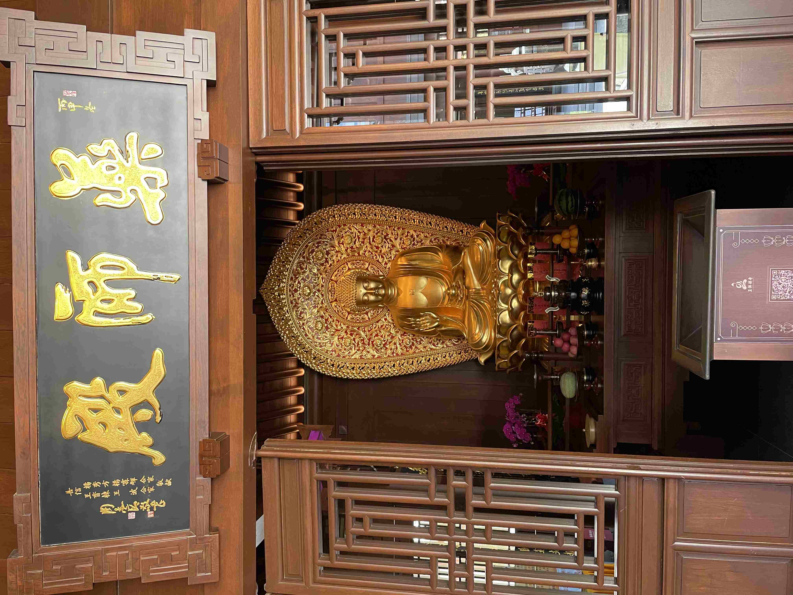

药师菩萨

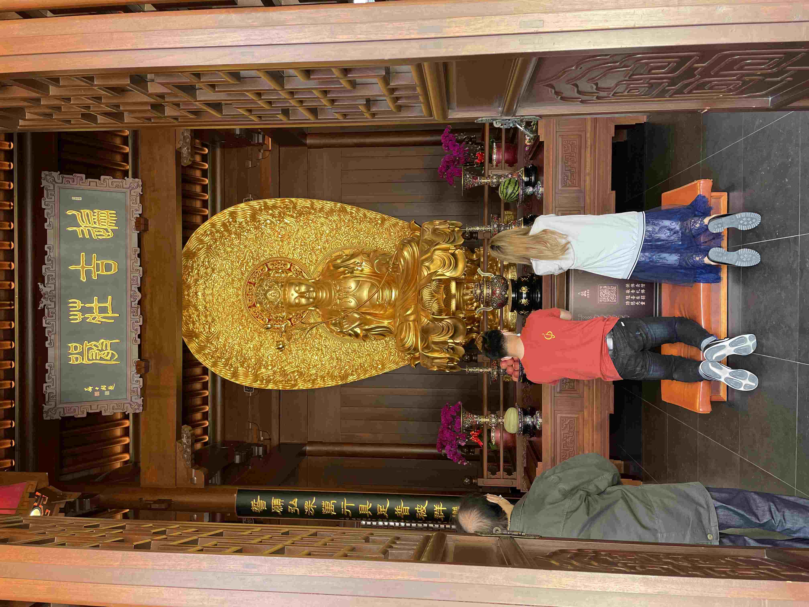

普贤菩萨

从旁边的对联「南海生妙相……」来看，这应该是观音

地藏菩萨，这是参拜的信众告诉我的。

这就不知道是谁了，工作人员说是观音。

不过里面的工作人员连带我看见的两个和尚都比较讨厌，我从他们的神情动作里面看出一种世俗的市侩和不耐烦。我想他们对佛法的认识还不如这些信众。

这位就老熟人了，想不到关公还是伽蓝菩萨。

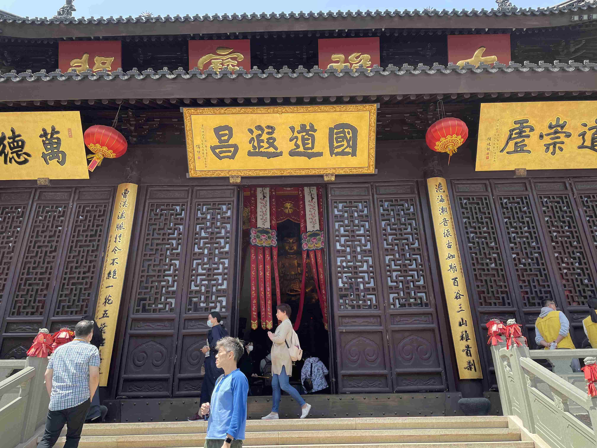

所以这其实是曹溪宗的禅寺？

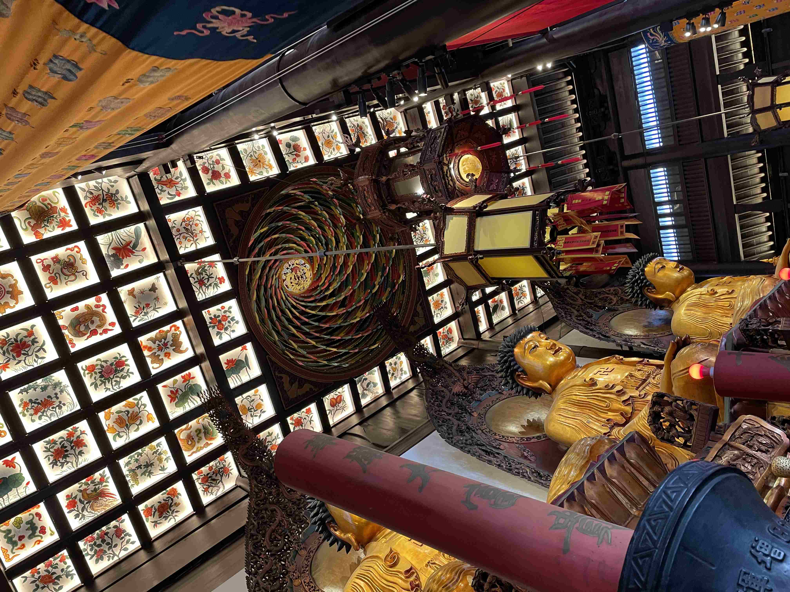

玉佛禅寺之所以得名，是因为后面还有一个玉佛殿，供奉一尊玉制的佛像（不知道是什么佛），因为里面说禁止拍照，所以我也没有拍照，但是意外在照片墙上看见熟人（江和朱），这个拍一下记录一下估计没有问题。

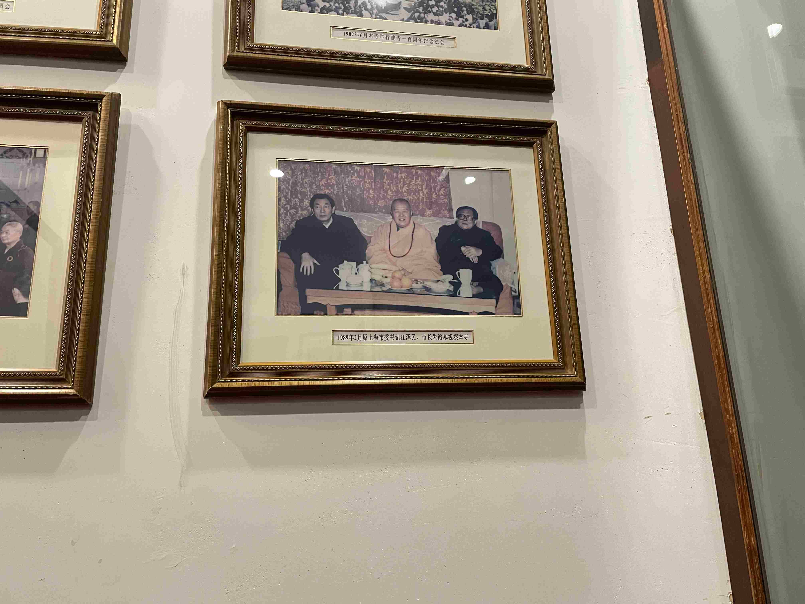

玉佛殿

我不反对寺庙做生意，不过一家禅寺，卖印着八卦的聚财符就有点过分了，加上前面那尊关公，我不能不想到「红花绿叶白莲藕，三教原本是一家」。

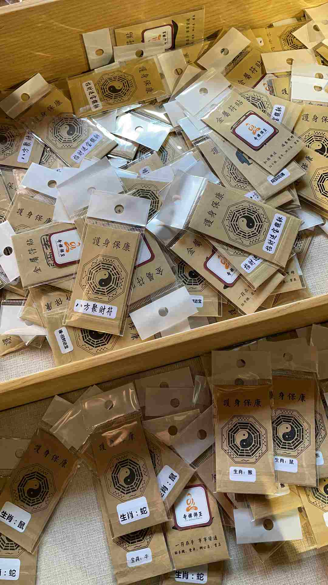

我一出玉佛寺的门，就有一个大妈上来问我算命不，我说你算出我今年几岁我就信你，大妈说算命是要知道生辰八字的。我就说我是1989年12月25日出生的，你算我今天会不会在你这里算吧，大妈说小伙子你什么意思，然后我就走了（万一还有个大爷埋伏一旁我可吃不了兜着走）。后面还有一个大妈拦路跟我说，小伙子你面相好，6到9月有双喜，今年肯定能找到女朋友，我就冲她喊了一句：我结婚十年了！禅寺旁边这么一堆算命的，释迦牟尼都不管管（释迦牟尼：不是我管的，该街道办派出所管！）

其实我来上海的目的就是看台儿庄站出来这个自由高达造像的（很好认路，一路上都有人拎着自由的拼装模型盒子）。定了去无锡的车票后，我看到新闻说这座造像快完工了，就想趁还没有完工过来看看，没想到紧赶慢赶还是完工了。看完之后还是挺失望的，内心充满「就这」的声音。

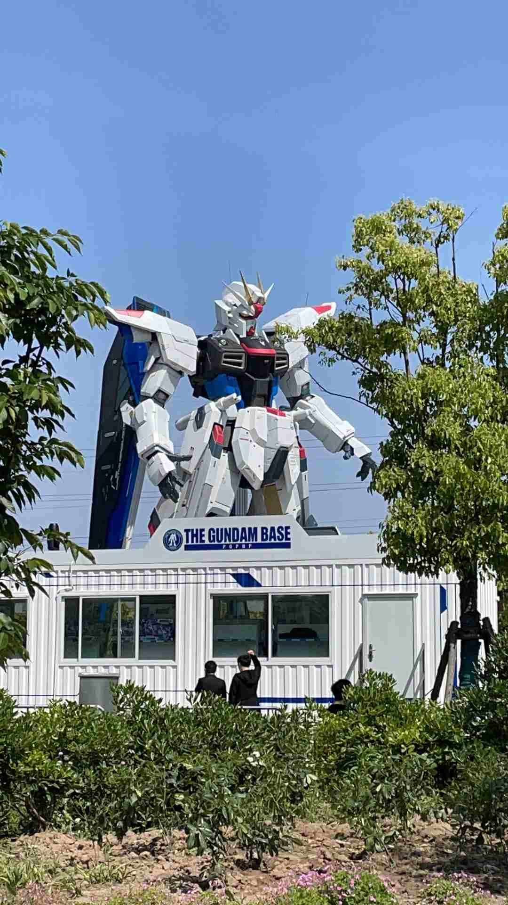

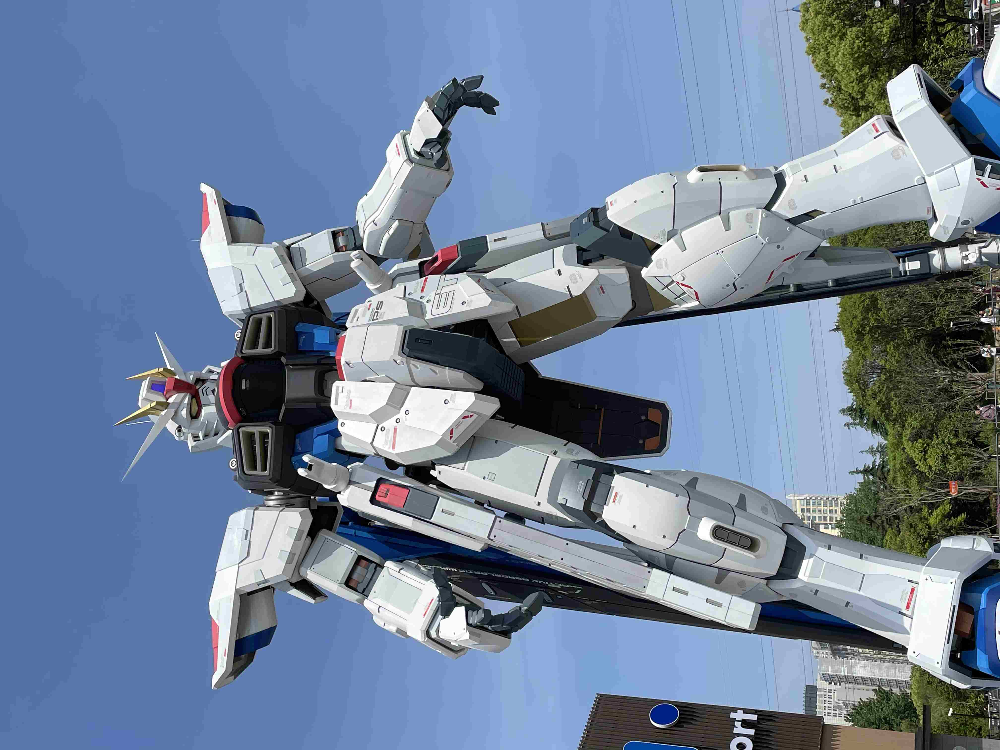

这一肩膀高一肩膀低的，我不能不想起张文顺老先生啊。今天比较遗憾的是现场没有看到 cos 成拉克斯的美丽少女。

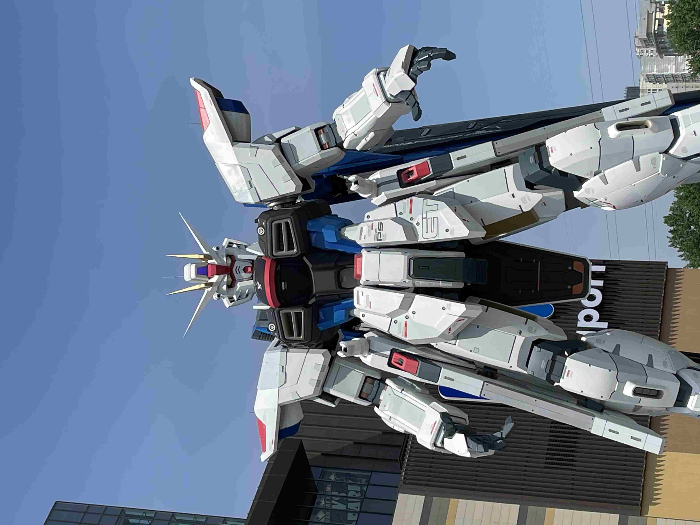

晚上约了舰哥跟球球吃完，看完还不到三点，我就过去鲁迅故居看看。想不到鲁迅故居约满了，所以我只能去附近的鲁迅公园走走，不过没有去鲁迅纪念馆（想想也知道鲁迅纪念馆会把他符号化成什么样子），鲁迅公园里面还有尹奉吉的事迹陈列馆（虽然很小实际就一个宣传栏）。

> 尹奉吉（韩语：윤봉길，1908年6月21日－1932年12月19日），本名禹仪，号梅轩，别号奉吉，本贯坡平尹氏，韩国独立运动家。

> 在1932年4月29日的上海虹口公园爆炸案中，他将日本上海派遣军司令白川义则大将和上海日本居留民团团长河端贞次炸死，并将日本海军第三舰队司令野村吉三郎中将（右眼被炸瞎），日本陆军第九师师长植田谦吉中将（左脚被炸飞），日本驻华公使重光葵（右腿被炸断，右臂骨折），日本上海总领事村井仓松（左臂和小腿被弹片穿透）和日本居留民团书记长友野盛（脸部和小腿受伤）炸伤。——维基百科

尹奉吉的刺杀虽然不能改变历史，但在万军之中刺杀敌军大将，是好汉子。我在霹雳布袋戏里面学到的经典传统智慧就是：「暴力不能解决问题，但能解决你。」

晚上去了梦心餐厅，感谢舰哥招待！虽然大部分网友都离开上海天南地北旅行了，但好歹见到球球了，网友见面次数加一。众所周知我跟舰哥的政治立场基本就是光谱的两端，之所以见面能谈笑风生，主要有两个原因：一是我打不过他（实话！）；二是交朋友不是交立场，键政这事口嗨一下就好，没必要挂心上。

上海菜虽然说「浓油赤酱」不过比无锡菜容易接受得多了。晚上本来想找找有没有扬州式的泡澡，最后还是放弃了，因为太饱了。

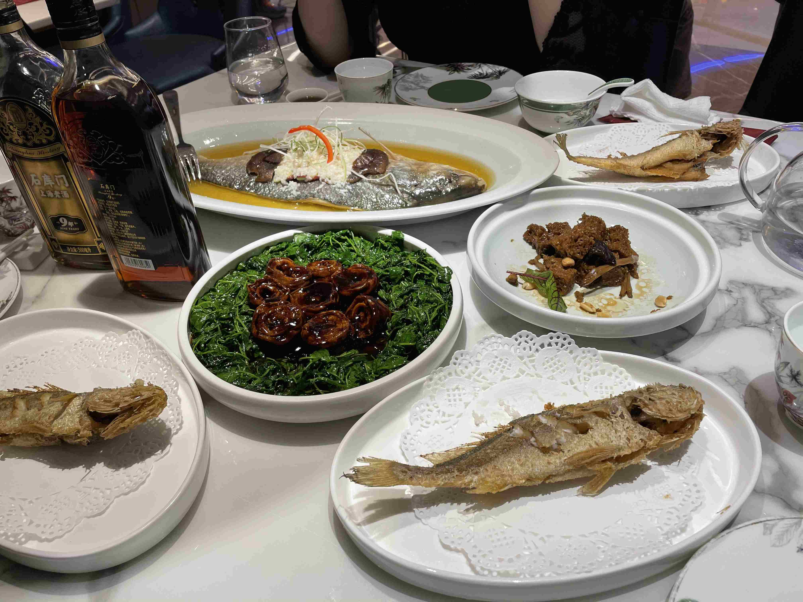

出游到了今天，觉得疲倦不断累积，实在难受，即使每天睡更长的时间也无法消除，万一我是一个肉体劳动者，估计会彻底吃不消。此刻的我只想快点回到家中（还得把臭 cat 接回家）。

# 上海第二天：文庙

约了 timfeirg 吃饭，不过看到静安寺地铁站就在两公里左右，我决定先骑车去那里，毕竟这个站有一墙《明日方舟》的宣传画（甚至有舟游的网友建议我去鹰角逛一下，但我又不想刺杀海猫——毕竟新六星都抽到了，所以没有去）。其实如果不是我赖床，我会去静安寺看看。

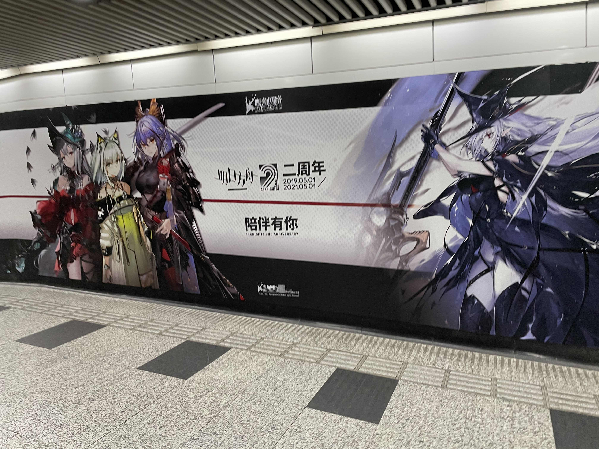

timfeirg 还是那么俊俏，虽然因为半月板的手术走路有点不便。聊起各自的生活，他现在过得非常潇洒。我们在盛伦餐厅吃午饭，这是一家本地餐厅（我挺佩服他能找到这样的餐馆，如果他或者其他朋友来深圳，我可能找不到这种充满生活气息的平民餐馆），菜单上都是比较正统的本帮菜（至少在我这种小赤佬看来就是上海本土风味了），我们点了马兰头拌香干、蒜爆鳝段、炸大排（加了南乳）还有裹着面糊炸的黄鱼。味道不错，深圳缺少这种本地人经营的餐馆——毕竟是打工人的城市。

吃完我才想起，北注（北京注定孤独一生协会）的叛徒貉绒老师也在上海，忘记蹭他一顿真是失算了。

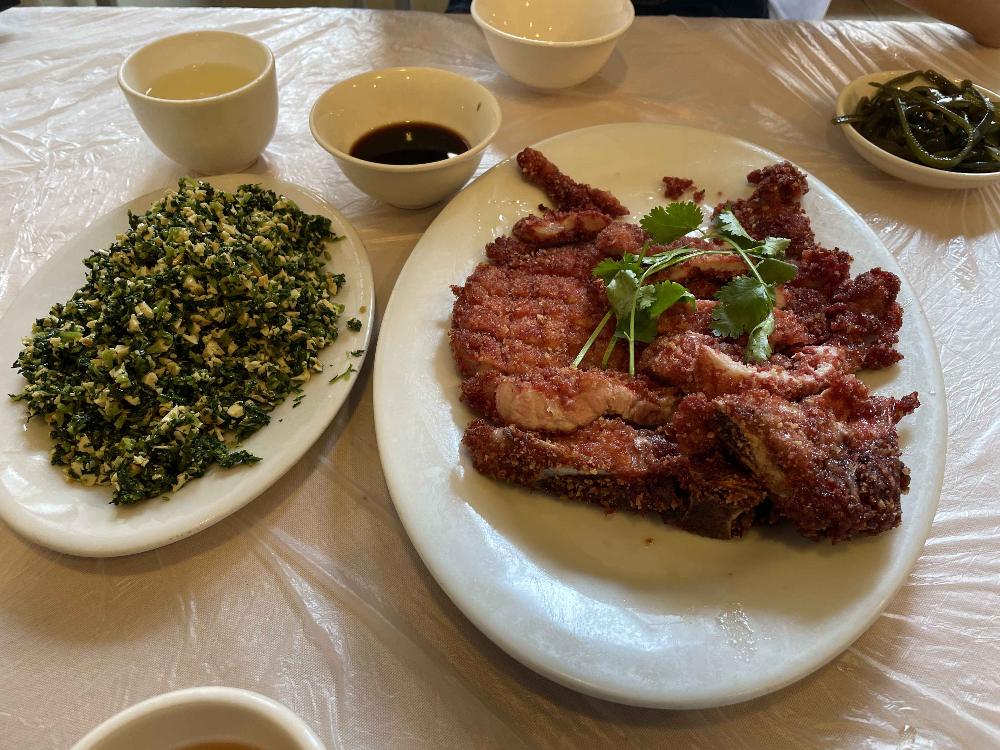

吃完我们去文庙逛，timfeirg 把文庙附近的一条巷子称为「上海秋叶原」，这条巷子机会都是卖模玩的店铺。这些店铺基本都是以拼装模型、奥特曼和假面骑士相关的商品为主，在陈列上各有不同（有些店铺陈列柜里面的高达已经蒙尘，或者老化，有些店铺就显得非常干净），几乎每一间的铺面都不大。不时会有三五发烧友进店，这时店面会变得很拥挤。

这些实体店出售的模玩品种不算很多（即使是 GSC 的粘土和 figma 种类也很不齐全，血源没有也就罢了，舟游相关的粘土也没有），价格也不一定公道。实体店的乐趣在于跟同好的交流。如果我的少年时代可以有这样的空间，我可能可以过得更快乐。

比如我看到泽塔跟赛罗的价格差异，会有爱好者告诉我因为赛罗是电镀的。看见《五星物语》的拼装模型会有同好过来介绍这部看不到完结的可能的作品。有个小孩对着货架上做工不太精致的奥特曼像报菜名一样吧奥特曼报出来（连艾斯和阿斯特拉都认得出，小朋友看来是个人才啊）。商店外有母亲质问儿子：「我都不明白你为什么就那么沉迷赛罗？」主打假面骑士的店铺里面，一群中年人腰上佩戴了假面骑士的变身腰带。

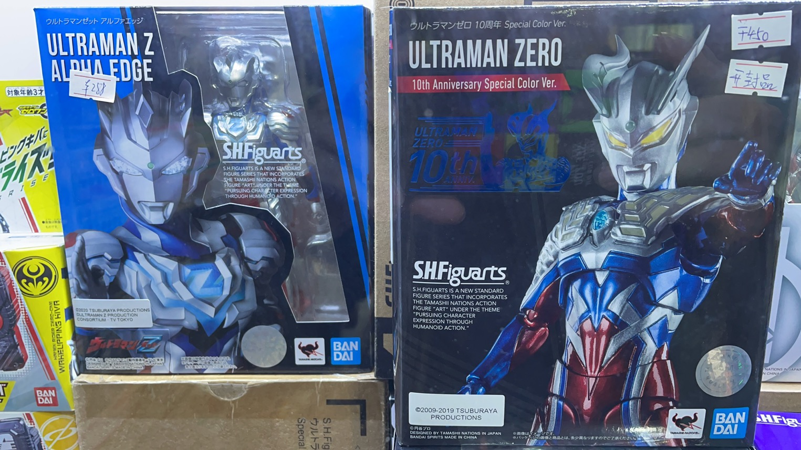

最妙的是一个中年阿姨店主。我吐槽里面的杀生丸做工粗糙（他右边那块毛皮被做成一块石头），阿姨听到之后就说：「这个价位不错了，140块，回去自己修修也挺好的嘛！」然后向我们推荐一个萝莉的手办（抱歉我记不住是哪个作品的）：「你们看这个，衣服可以换的，哎你们害羞什么嘛？我都不害羞，我都被你们带入坑里了。你们看，那边还有很 Saber 呢？我最初都不懂的，都是被你们这些客人带进这个坑出不来了。你们一定要带个美女回去啊。」——当然我们都没有买。

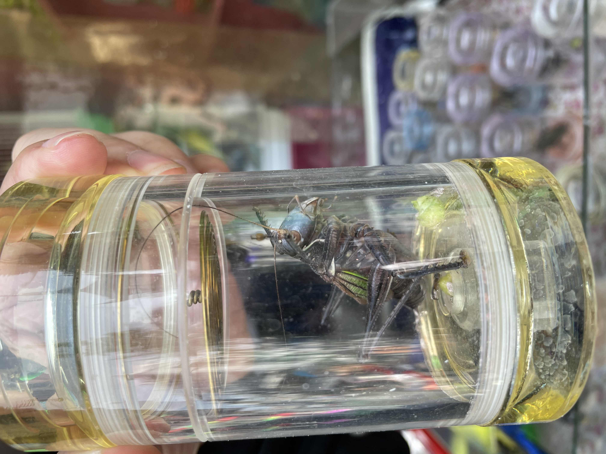

逛完这条巷子的模玩店，我们去看了文庙（其实就是孔庙），里面也是提供铺位给文创单位。出来后我们在一家旧书店淘了一阵，我找到一本87年出版的文革评论集《十年后的评说》，这估计是一本有趣的书（不知道什么地方可以提供图书扫描服务，把它扫成电子版应该会很有趣）。

本来我们打算打车去新天地的，不过诅咒滴滴，它把司机定位到离我们有一段距离的地方，我们互相看不见。最后改为走路去新天地。再从新天地坐地铁去 IAPM，逛到4点多，我和奕夫挥手道别。我出发去机场。这次旅游到达尾声。

# 归途

因为买不到晚上出发早上到达的高铁/动车（据舰哥说，其实周末会有这样的列车），所以我最后买了南航的机票。如果没记错的话，19年之后我应该都没做过飞机（20年辞职从北京回来的时候我是一路坐火车回来的）。我连怎样值机都忘记了。最后飞机还延误了，非常无奈。在机场把方舟的新剿灭打过了，终于可以上摆渡车的时候我还瞟到另外一个博士（他可能是过来看音乐会的）也在打剿灭。

说实话，其实我有点害怕坐飞机，但也没有害怕到彻底不敢坐的地步，每次坐飞机我都会幻想飞机失事（这段话是在飞机上打的，要是真的失事了它都无法同步到服务器）。未来的假期我可能都会考虑坐火车，去一些不大的城市——绝大部分景点都能在10公里之内到达就最完美了。

出发前买的蓝牙键盘非常好用，在不带电脑的前提下，我可以用手机写下啰里八嗦的大段游记。带着廉价的茶叶出来也是一个明智的选择，没有这些茶叶，火车上的水是十分难喝的。改进之处是下次可以先留意一下当地的城区建设，考虑住在比较老的城区，这样方便我找到本地人开的餐馆。

当然，还是要养成早睡早起的习惯，不然到时候去扬州等地都没办法享受早茶。