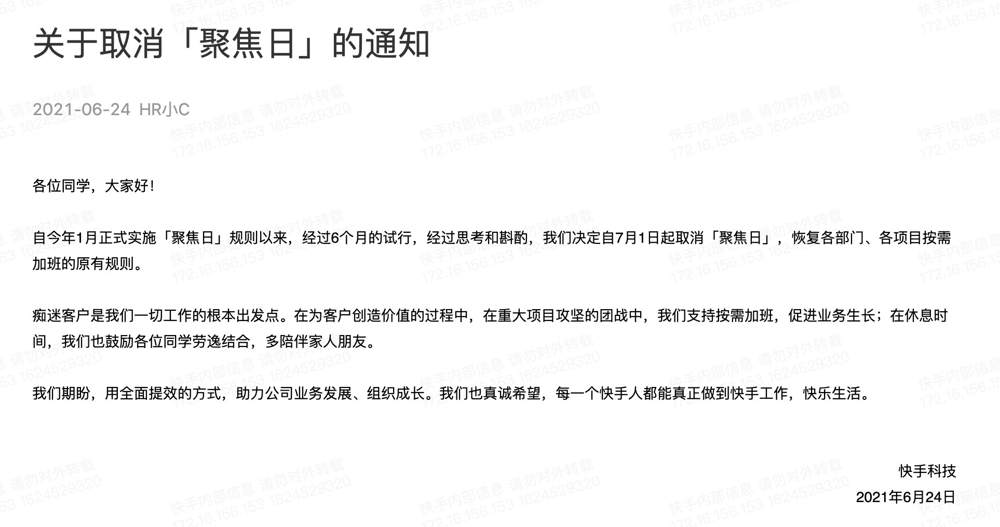
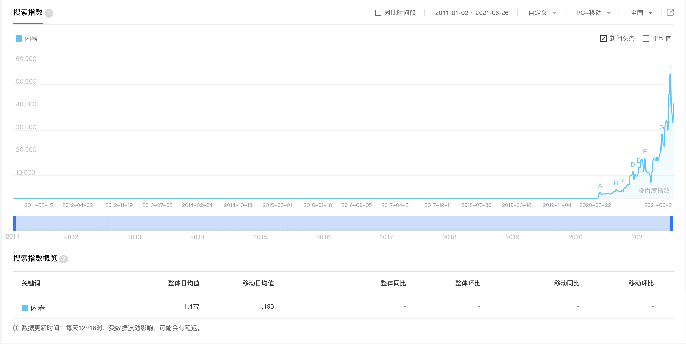

996ICU 运动与「内卷」的流行似乎有逻辑上的关联。它们都表达了对当下社会的不满与焦虑。

## 996ICU 是一句优秀的口号

2019年4月的时候，我写过一篇 [《我们为什么要反对996？》](https://zhangyet.github.io/archivers/anti_996)，当时正是 [996.icu](https://996.icu) 网站上线不久，我刚从滴滴离职，准备加入新公司。在《我们为什么要反对996？》的结尾，我写到：

> 作为一个悲观的人，我觉得 996icu 运动最后会不了了之。

现在翻阅 [996icu README](https://github.com/996icu/996.ICU) 下相关的 repo，大部分 repo 都已经放弃更新。最近关于IT行业工作时长最引人注目的新闻就是快手取消一月开始执行的大小周：

    

与之相映成趣的是[《字节跳动1/3员工不支持取消大小周 员工：每年少赚10万块》](https://finance.sina.com.cn/chanjing/gsnews/2021-06-20/doc-ikqcfnca2093530.shtml)。

996icu 相关的 repo 停更，快手、字节（以及我懒得搜新闻链接的腾讯）最近都考虑减少**明确要求的工作时间**，综合这些情况，我很难作出「996ICU 徒劳无功」这样的结论，也不能说「996ICU 卓有成效」。

要搞清楚一个运动到底做成多大的影响，需要投入极大的精力，统计数据梳爬史料，才能作出有意义的论断。我当然做不到这点。我只能从我个人的情况出发，讨论一下受 996ICU 启发而开始思考的问题。

我认为，无论如何，996ICU 是一句出色的标语，它简短（6个音节6个字符）、对称（前三后三）、将繁重的工作时间与身体健康的耗损非常形象地用「996」和「ICU」联系起来。从宣传效果来说，确实无与伦比。

值得思考的是，这句出色的口号到底能多大程度反映真实的劳工状况，又或者它有效概括的范围是多大？

分开两部分来考虑，996能描述中国所有的行业吗？或者缩小一点，它能概括中国的 IT 行业吗？就我个人的经验来看是不能。我经历过两大两小四家公司，四家公司都没有字面规定要求员工9点到岗9点下班一周工作6天（或者10点上班10点下班之类的硬性12小时工作时长），除了第一家公司在走下坡路的时候要求打卡，其余公司都没有打卡的要求。公司对工作时间的要求并不强硬（这当然给了公司在算工时的时候耍流氓的方便，参看 [腾讯员工工作不足8小时被辞退](https://zhuanlan.zhihu.com/p/161808351) ）。

在 IT 行业，周末的工作群和突发的事故处理常常可以毁掉美好的周末和假期，在北京工作的时候我出行基本离不开电脑——因为随时可能有线上情况需要我查日志，和朋友约饭途中掏出电脑查日志这种表演我演出过好几次。互联网让我可以随时随地工作造成了「互联网令我有随时随地工作的可能」。

所以，即使在互联网行业，我认为单纯谈论工作时长，并不能完整描述从业人员的工作压力，我觉得还是梁萌的 [《加班》](https://book.douban.com/subject/34834449/) 概括得比较全面：

> 其中企业文化是工作压力形成的意识形态基础，管理制度是组织运营方面的管理控制手段，负责将企业文化从口号落实到企业的日常运营当中，技术发展则是将工作压力最终嵌入劳动过程之中的推进器，随着技术开发模式的发展，劳动过程中的工作速度和工作要求都不断攀升。这三个机制互相呼应、互相支撑，形成了易万公司工作压力的完善机制。

再说「ICU」部分。在我的圈子，IT 从业人员猝死总能引起大规模转发评论。去年有 [拼多多女员工猝死](http://news.eastday.com/eastday/13news/auto/news/china/20210104/u7ai9677896.html)，今年有 [2021年5月6号深圳程序员猝死](https://baijiahao.baidu.com/s?id=1699090967919113486&wfr=spider&for=pc)，后者反响不大。在刻板印象中，猝死如996般跟程序员如影随形。

不过我没有查到各行业的猝死统计，不知道行业分布，根据 [中国劳工通讯《安全生产》一文](https://clb.org.hk/zh-hans/content/%E5%AE%89%E5%85%A8%E7%94%9F%E4%BA%A7)，中国各行业安全事故中建筑业占最多数，其次是环卫工，IT从业人员估计被归类到其他中去了。

深圳是一座工地城市。整个城市几乎没有一条街道不在动工中。很长一段时间叫醒我的不只是闹钟，还有小区市政施工的噪音。各种挖掘工具的噪音可以逼到我周末回公司呆着。但是就我所见，在这种高噪音场合工作的工人，没有一个带耳机等听力保护装置的。施工噪音可能对他们造成永久性听力损伤。

就劳工通讯的图表和我个人观察，IT 行业对健康的损耗并不是当下中国劳工环境最严重的问题。但是因为传播方便，IT 行业从业人员猝死的新闻可以占据大量的吸引力。这其实不是好事，真正有需要的人（比如建筑行业受工伤的人）反而无法在主流媒体中发出自己的声音。

所以尽管 996ICU 是一句优秀的口号，但它未能完全反映社会现实。

## 被滥用的「内卷」

百度搜索指数让我觉得惊奇，「内卷」一词是2020年8月才开始爆红的，查维基百科和百度，我实在想不到当时发生了什么事情，让内卷爆红。再查一下当时的日记，嗯，当时工作焦头烂额，有将近半年没有写日记（只写了工作日志但是工作日志不会记录时事）。

我一直认同 [知乎姜源对内卷的看法](https://www.zhihu.com/question/283762516/answer/875741844)：

> “内卷”是一个非常玄学的概念，而在知乎的语境中，这个概念不仅玄学并且扯淡。原因很简单，在任何一个给定的环境中，资源永远是有限的，竞争永远是存在的，而绝大多数人的日常工作是平凡无奇的，本来就没有什么特别的意义或者价值，但是并不能因此就扣上一顶“内卷”的帽子。

> 之前两个例子其实还没有说明“内卷”概念的根本缺陷。“内卷”概念的根本缺陷在于，这个概念是一个事后评价概念。当时代的人无从判断劳动生产率长期而言是提高还是停滞的。

如果觉得知乎充斥水军，那我们看看文科博士遍地走的豆瓣是怎么说的。豆瓣有个话题：[你所在专业或从事行业有哪些“内卷”现象](https://www.douban.com/gallery/topic/148811/) 看了里面的举例，我觉得槽点挺多的：

比如这位叫纯阳子的豆瓣用户 [认为对内卷理解到位是这样的](https://www.douban.com/people/152184722/status/3135496322/)：会议上把杯子摆整齐是内卷，微雕也是内卷，高考是内卷，研究《红楼梦》也是内卷，传统习俗还是内卷[^1]。

这位千里光用户认为[留洋学生应聘邮政银行是内卷](https://www.douban.com/people/166502307/status/3345048252/)。

这位林米露用户认为[顶级学校毕业生应聘 BAT 码农是内卷](https://www.douban.com/people/160979854/status/3348976570/), 当然他老人家把[早上买菜抢不过老人家都算进内卷里面了](https://www.douban.com/people/160979854/status/3459216467/)。

> 我对象，BAT某大厂高级工程师一枚（好吧说人话就是程序员，码农），今天面了一个清华大学自动化专业明年毕业的学生。我刚刚问他面得怎么样，结果是不合适，给淘汰了。原因是非计算机专业，基本功不够。听说他们公司其他几位同事看过这位同学的简历后，都说清华的来求职太屈才了。但就我所知的，今年过完年，他们已经收到好多国内顶级学校和海外名校学生的简历，除清北复交，还有港大、东大、UCLA等等。我说他们真是想不开啊，干什么不好非得受加班的苦？我对象：但是给的钱多啊。这……我还能说什么呢

当然，还是有豆瓣用户会追溯内卷这个概念的起源的，比如这位[不含](https://www.douban.com/people/41664273/status/3169260609/)。

还有这位[岁暮亦云已](https://www.douban.com/people/195172588/status/3222074682/)更深入一点：

>  在这个“内卷”话题下，我觉得有一些回答已经带有情绪发泄性质了。而这种发泄，反而掩盖了很多真实问题。

>  例如将所有加班都视为“内卷”，其实这是掩盖了劳动法保障不健全的问题。假如劳动法保障够刚性，当暗示加班成为一种人人鄙视的违法猥琐行为时，加班生态是绝对可以好转的。而乱用内卷概念，则会把责任归于员工身上，反而忽略了法律制度、企业的问题，这就掩盖了真实的问题所在。（多年前喝酒开车是常态，北京室内抽烟是常态，一旦法律法规够刚性，这些都瞬间解决了。）

>  如果将求职时学历要求越来越高视为“内卷”，实际是掩盖了求职者的学历、竞争力焦虑。我小学时的老师都是中专生，我中学时的老师都是本科生（当时还有个别专科生）。现在呢？我当年读书的小学，老师最起码是本科生，中学老师很多都是硕士生。教师团队的学历、整体素质都在提升。这是社会对岗位人才的要求越来越高，我们需要不断学习来提升自己。现在哪怕是种个水果，都要学习怎么拍视频，在网上搞营销。所以这并不是内卷，而是社会发展对岗位人才的要求越来越高。而这个高要求，整体上是可以创造更高社会价值的。
##  世界的词语是森林[^2]

上星期五我重读《地海巫师》的时候，重读到这一段：

> 海洋的名字是‘伊尼恩’，人尽皆知，没有问题。可是，我们称为‘内极海’的那片海洋，在太古语里也有自己的名字。既然没有东西会有两个真名，所以‘伊尼恩’的意思只可能是：‘内极海以外的全部海洋’。当然它的意思也不仅止于此，因为还有数不清的海洋、海湾、海峡，各自有各自的名字。因此，要是有哪个海洋法师疯狂到想要对暴风雨施咒，或是平定所有海洋，他的法术就不仅要念出‘伊尼恩’，还得讲出全群岛区、四陲区，以及诸多无名的所在以外，全部海洋的每一片、每一块、每一方。因此，给予我们力量去施展魔法的，也同时限制了这个力量的范围。也因此，法师只可能控制邻近地带那些他能够精准完备地叫出名字的事物。

我觉得这一段故事可以很好地解释为什么我反对滥用「内卷」：当我们含混地使用「内卷」表达我们的境况，这个概念的内涵就会膨胀，最终的结果就是，我们无法用这个概念沟通——你说的内卷和我说的内卷可能是风牛马不相及的两个意思，而内卷也会因此失去描述问题的能力。如果连描述问题都做不到，那解决问题也就无从谈起。

我并不是反对在日常滥用内卷，毕竟精准用词并非想象那么简单。我只是觉得如果要严肃地讨论某些问题，就应该严肃谨慎地选择用词。

## 跟住去边度[^3]

稍微学过统计学之后，我发现很多结论其实适用范围并不广，但严肃的结论好歹还有数据，还有推导。泛滥于社交媒体的大多数言论只能说是「张口就来」。

比如说我要讨论996的问题，那不调查一下各大公司如何制定工作时间规定、如果落实、员工实际的工作时长，那其实没有什么可信的结论。一间足够大的公司，往往不同部门不同小组之间的差异非常大，仅凭「我曾经……」「我有个……」「用我亲身经历……」就外推出一个适用全中国的结论，这不就是扯淡么？[^4]我在这篇博文里面扯的淡主要也是从我自身经验而来，但我必须 **明确表示我并不认为这些结论有坚实的基础，实际上它们更像是问题而不是结论**。

为了探究内卷的含义，我其实找来[《华北的小农经济与社会变迁》](https://book.douban.com/subject/1018498/)，虽然读得很马虎且没有读完，但我也有一些有趣的发现。

[^1]: 摆茶杯这个例子其实跟内卷一点关系都没有，因为它都不存在竞争，更多的是形式主义和官僚主义。微雕就是一种技艺，当然可以说没什么用，但是连技艺都说成内卷，就太过了

[^2]: 这是厄休拉·勒古恩一本小说的名字，我看了小说梗概，跟我接下来要说的内容有那一点相关。主要想当我想写这一节的标题是，这个书名 come to me.

[^3]: 这其实是黄子华一个栋笃笑的名字，从粤语翻译过来就是《接下来去哪里》，这栋笃笑反映港人面对九七即将来临的惶惑。

[^4]: 知乎就是重灾区，当然豆瓣也没好哪里去。